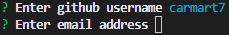
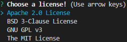

# readme-generator

## Description

This command line application allows the user to create a high quality readme with ease. The inquirer and file system modules are the focus of this project.

https://user-images.githubusercontent.com/50060256/197293945-1d953ea4-ea1a-4a71-a247-8fcde7542c2a.mp4

Inquirer is used to get text input from the user via the command line as shown below.



Inquirer is used to get a user to choose from a list of options via the command line as shown below.



File System from Node JS is used to write files using the information gathered from the user in the command line. The file name and readme text is provided to a writeFile function that will create a file with the information given. A code snippet  demonstrating this is shown below.

```js
fs.writeFile(`${fileName}.md`, fileText, (err) => {
        if (err) {
            console.error(err);
        } else {
            console.log('Writing readme was a success!');
        }
    })

```


## Technologies Used

- [Node JS](https://nodejs.org/dist/latest-v16.x/docs/api/)
- [Inquirer](https://www.npmjs.com/package/inquirer)
- [Visual Studio Code](https://code.visualstudio.com/)
- [Github](https://github.com/)
